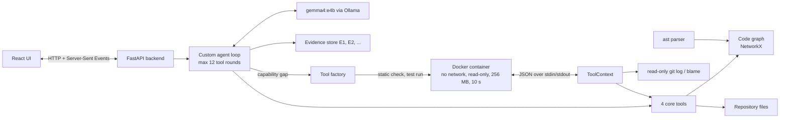

# AI Engineering Assistant

An assistant that answers questions about an unfamiliar **Python** repository: its structure, execution flows, dependencies, implementation behaviour and documentation. It builds its own code graph (GraphRAG), runs a **custom agent loop** (no agent frameworks) with four general-purpose tools, notices when those tools are not enough, and then **generates, checks, test-runs and uses a new tool** inside a locked-down container. Everything runs locally with a small open model through Ollama, so repository content never leaves the machine.

Design: [docs/PLAN.md](docs/PLAN.md) · Build log with every decision and deviation: [docs/DEVLOG.md](docs/DEVLOG.md) · Evaluation: [eval/RESULTS.md](eval/RESULTS.md)

## How it works



1. **Ingestion:** a Git URL or local path is cloned into `workspace/` and parsed with Python's `ast` (its code is never executed) into a graph of modules, classes, functions, routes and doc sections, linked by CONTAINS, IMPORTS, INHERITS, HANDLES, MENTIONS and CALLS. Every call is marked **resolved**, **ambiguous** (candidates listed) or **unresolved**; only resolved calls count as confirmed paths. A call on a parameter annotated with a repository class (`repo: ArticlesRepository = Depends(...)`) or on an attribute set in `__init__` (`self._tags = TagsRepository(conn)`) resolves to that class's method, since the code states the type; it stays ambiguous if a subclass overrides the method.
2. **Core tools:** `search_code` (ranked lexical search over symbols, routes, docstrings, docs and source), `query_graph` (callers, callees, imports, contains, handlers, ... up to depth 3), `read_file` (numbered lines) and `list_files`.
3. **Agent loop:** each model reply becomes exactly one action (tool call, capability gap, final answer or invalid). Full tool results are kept as evidence `E1, E2, ...`; the model sees compact versions. Answers cite evidence (`[E3, app/x.py:42]`). The backend checks, without another model call, that every cited id exists, that every cited `file:line` exists and lies inside what that evidence showed, and that every file or folder the answer names exists; an answer that fails goes back to the model once for a rewrite, and anything still wrong is listed with the answer.
4. **Dynamic tools:** when the model reports a gap (e.g. "no tool reads git history"), the factory asks it to fill in the body of a fixed `run(args, ctx)` template. The code is statically checked (allowlisted imports, no `eval`/`exec`/`open`/`os`/`sys`/`subprocess`/dunders), then **test-run in a throwaway Docker container** on its own example input, with one retry on failure. The test also checks what the tool answers where that can be checked: a tool that reports commits for a function is rejected if those commits did not change the function's lines, and a tool for a named function may not require a file path the agent does not have. A passing tool is kept for later questions on the same repository and commit (while the backend runs), and its code and validation record are saved under `workspace/tools/`. The tool reaches repository data only through `ctx` (the core tools, `list_nodes`, read-only `git_log`, `git_log_lines` (history of a line range, via `git log -L`) and `git_blame`), one JSON message per line.
5. **UI:** one screen with a repository bar, a chat (Markdown, a Mermaid diagram of the calls the agent followed, clickable citations) and a live activity panel (each tool call, gap and created tool; click for full results or the generated code and its test run). For any loaded repository, five starting questions are suggested from its own graph (a real route, its most-called function, its most-imported module, and a git-history question), so an unfamiliar repository never starts from a blank page. After the first question they stay available from a **Suggestions** button next to the question box (questions already asked are left out).
6. **Saved answers:** every finished answer is saved to a local SQLite file (`workspace/history.db`) with its question, answer, diagram, citations, activity steps and evidence. **History** in the repository bar lists the saved answers for the loaded repository; opening one replays it exactly as it looked live, without calling the model again. The last loaded repository is remembered (`workspace/state.json`) and reopened when the backend restarts. The repository input also lists the last 8 Git URLs or folders that loaded successfully (`workspace/state.json`); typing filters them and clicking one loads it.
7. **Repository introduction:** after a repository loads, a 2-3 sentence introduction appears above the suggested questions. It comes from one short model call (no tools) over facts taken from the graph (main libraries, packages, routes) and the start of the README, takes about 10-25 s, and is cached per commit in `workspace/intros/`. If the model cannot be reached, a plain sentence built from the same facts is shown instead.

## Setup (Windows)

Tested on Windows 11 with an Intel Core Ultra 5 225U, 32 GB RAM and no GPU. No administrator rights are needed apart from enabling WSL.

**Prerequisites**

| Tool | Used for | Notes |
| --- | --- | --- |
| Python 3.13 | backend | `py -3.13` |
| Node.js 24 LTS | frontend | |
| Git | cloning, git history | |
| Ollama | local model | then `ollama pull gemma4:e4b` (9.6 GB) |
| WSL 2 with an Ubuntu distro | container runner | needs admin once to enable WSL; see below |

**1. Backend**

```
cd backend
py -3.13 -m venv .venv
.venv/Scripts/python -m pip install -r requirements-dev.txt
.venv/Scripts/python -m pytest
```

**2. Frontend**

```
cd frontend
npm install
```

**3. Container runner for generated tools.** Docker Engine runs inside WSL (no Docker Desktop needed):

```
wsl -d Ubuntu -u root -- bash -c "apt-get update && apt-get install -y docker.io debootstrap"
wsl -d Ubuntu -u root -- bash runner-image/build-local.sh
```

`build-local.sh` builds the runner image `aiea-python-base:local` (Ubuntu 24.04 + Python 3) from the Ubuntu package mirror, for networks where Docker Hub is blocked; where Docker Hub is reachable, `docker build -t aiea-python-base:local runner-image` works too. The backend calls `wsl -d Ubuntu -u root -- docker` on Windows and `docker` elsewhere; set `AIEA_DOCKER` to override. Without the image, the assistant still works but reports capability gaps as unresolved instead of creating tools.

If `wsl --install -d Ubuntu` fails on a corporate network (certificate errors), import Ubuntu by hand: download `ubuntu-noble-wsl-amd64-wsl.rootfs.tar.gz` from `https://cloud-images.ubuntu.com/wsl/releases/24.04/current/` and run `wsl --import Ubuntu %LOCALAPPDATA%\wsl\Ubuntu <file>`.

## Running

Start Ollama (it normally runs in the tray), then in two terminals:

```
cd backend
.venv/Scripts/python -m uvicorn app.main:app --reload
```

```
cd frontend
npm run dev
```

Open http://localhost:5173, load a repository in the top bar (for the demo: `https://github.com/nsidnev/fastapi-realworld-example-app`, about 5 s), and ask a question in the box at the bottom. Answers take **2-6 minutes** on a laptop CPU; the activity panel shows progress. **Stop** ends a question at its next step (a model call already running finishes first). Local folders can only be loaded from the allowed roots (see `AIEA_ALLOWED_ROOTS` below); Git URLs work from anywhere.

Command-line equivalents:

```
cd backend
.venv/Scripts/python -m app.graph.build https://github.com/nsidnev/fastapi-realworld-example-app
.venv/Scripts/python -m app.tools search_code '{"query": "POST /articles"}'
.venv/Scripts/python -m app.agent "What happens when POST /articles is called?"
```

Run the evaluation: `cd backend && .venv/Scripts/python ../eval/run_eval.py` (about an hour).

Configuration: `OLLAMA_MODEL` (default `gemma4:e4b`), `OLLAMA_URL` (default `http://localhost:11434`), `OLLAMA_NUM_CTX` (default 16384), `AIEA_DOCKER` (Docker command), `AIEA_ALLOWED_ROOTS` (folders the UI may load local repositories from, separated by `;` on Windows; default `workspace/` and your Desktop).

## Evaluation

Eight questions on the demo repository (structure, flow, dependencies, implementation, documentation, a nonexistent symbol, runtime-only data, and a git-history gap run three times), with expected answers written before any run and every answer checked by hand. Full write-up: [eval/RESULTS.md](eval/RESULTS.md).

| | Round 1 | Round 2 (after fixes) | Rounds 5-6 | Round 7 (reliability fixes) |
| --- | --- | --- | --- | --- |
| Q1-Q7 correct or mostly correct | 2 / 7 | 5 / 7 | 4 / 7 (Q6 search varied) | 5 / 7 |
| Q1-Q7 answers with valid citations | 5 / 7 | 6 / 7 | 7 / 7 | 7 / 7, every cited line inside its evidence |
| Git-history gap: reported / tool created / correct | 3 / 3, 0 / 3, 0 / 3 | 3 / 3, 3 / 3, 1 / 3 | 3 / 3, 3 / 3, 1 / 3 | **3 / 3, 3 / 3, 3 / 3** |
| Runtime question: invented a value | 0 / 1 | 1 / 1 | 0 / 6 | 0 / 4 |
| Structure answer names a folder that does not exist | yes | yes | yes | no (caught and rewritten) |

**Not only the demo repository:** the same assistant was also run on two repositories it had never seen, a library ([pallets/itsdangerous](https://github.com/pallets/itsdangerous)) and a Flask app ([miguelgrinberg/microblog](https://github.com/miguelgrinberg/microblog)). Both loaded in about 2 s with no parse errors; a flow question got a correct, cited answer, an implementation question a mostly correct one, and a git-history question created and used a tool (author right, function-level date not determined, said so). Details in [eval/RESULTS.md](eval/RESULTS.md#unseen-repositories-generality-check-2026-10-01).

Round 7 (2026-10-08) measured the reliability fixes listed under Dynamic tools, Agent loop and Ingestion above: the git-history question went from 1/3 to 3/3 correct, and the invented folder in the structure answer is now caught; the flow answer (Q3) did not improve, because the model asked for the handler's callers instead of its callees. Details in [eval/RESULTS.md](eval/RESULTS.md#round-7-reliability-fixes-2026-10-08).

Six rounds were run on the demo repository before that; each was committed as it ran, before its fixes. The evaluation found four real bugs: Ollama's default **4,096-token context silently dropped the system prompt and question** from longer prompts; `read_file` showed the model only 60 of the lines it returned; generated tools were tested on invented names; and a **generated tool returned a hard-coded number** that the agent reported as fact with a valid citation (tools that read no repository data through `ctx` are now rejected). Later rounds added a citation check and a code-built list of unconfirmed calls. One prompt change (round 5) caused a regression, stopping the git-history gap from being reported, which round 6 fixed; prompt tuning was then stopped, since each change traded one behaviour of the small model for another.

## Deviations from the plan

[docs/PLAN.md](docs/PLAN.md) is the design as approved before development; it is kept unchanged. What the build does differently, and why (details and dates in the [devlog](docs/DEVLOG.md)):

| Plan | Built | Why |
| --- | --- | --- |
| Docker Desktop runs generated tools | Docker Engine inside WSL Ubuntu, runner image built locally from the Ubuntu mirror | No admin rights on the development machine; Docker Hub blocked by the network. Same container limits |
| Model: Qwen3 4B or Gemma 4 E4B | `gemma4:e4b` | Chosen by the phase 1 test (6/6 tool calls vs inconsistent qwen3:4b) |
| Python 3.12 | Python 3.13 | Already installed; approved in phase 1 |
| 12 evaluation questions, two gap types (`function_history`, `find_uncalled_functions`) | 8 questions, one gap type (git history, run 3 times) | The plan's reduced scope for the 3-day schedule; uncertainty cases kept (nonexistent symbol, runtime-only data) |
| Docs: README/Markdown headings | Markdown and reStructuredText | The demo repository's only doc is `README.rst` |
| Mermaid diagrams written by the model | Built in code from the graph edges the agent visited | The model never produced them; this also guarantees only visited nodes appear |
| Repository bar shows indexing progress | A spinner while the graph builds (~5 s for the demo) | Simpler; indexing is fast at this size |
| — (not in plan) | Stop button; local folders limited to allowed roots; generated tools must read data through `ctx` | Added after the final review and evaluation |
| — (not in plan) | Saved answers in SQLite and a History panel; last repository remembered across restarts | Added on request so answers survive a restart; standard-library `sqlite3`, no new dependency |
| — (not in plan) | A 2-3 sentence introduction after loading a repository | Added after the assignment, on request; one model call, cached per commit |

## Assumptions

- Python repositories only; parsing uses the standard `ast` module.
- Small to medium repositories (the loader rejects more than 5,000 files; files over 1 MB and binaries are skipped).
- One user and one repository at a time; each question is answered independently (no conversation memory). Answers are saved for reopening, not fed back to the model as context.
- A local model is required rather than a hosted API; `gemma4:e4b` was chosen by a measured test (see DEVLOG): it made 6/6 correct single tool calls where `qwen3:4b` was inconsistent.
- The analysed repository is trusted to be parsed but never executed; generated tools are untrusted and only run in containers.

## Limitations

- **Speed:** CPU-only inference is 7-35 s per tool step and 1-3 minutes for the final written answer, so a question takes 2-6 minutes, and one with tool creation longer.
- **Answer completeness:** the small model sometimes stops short (a flow answer that does not follow the call into the repository), leaves out citations on overview questions, picks the wrong relation (callers instead of callees), and never explained that runtime data (e.g. how many rows are stored) cannot be known from code.
- **Context size:** the model is run with a 16,384-token context (`OLLAMA_NUM_CTX`). Ollama's default of 4,096 silently cuts the start of longer prompts.
- **Generated tool quality varies:** the pipeline checks that a tool is safe, runs, reads repository data through `ctx` and, for function histories, reports only commits that changed the function. Beyond that it cannot check that a tool computes the right thing. Before round 7, 2 of 3 git-history tools used the file's last commit and gave a wrong date; that mistake is now rejected. Function history stops where a function was moved to another file or renamed (`git log -L` follows lines within one file).
- **Citations prove existence, not truth:** a generated tool once returned an invented value, and the agent cited it correctly. Tools with no `ctx` reads are now rejected, but a tool that reads data and then computes a wrong result would still be cited.
- **Static analysis:** objects whose type is not written in the code (values returned by functions, local variables, dynamic dependency injection), polymorphism and reflection appear as ambiguous or unresolved calls; methods inherited from library classes (e.g. pydantic `from_orm`) are unresolved; route prefixes that come from runtime settings (the demo's `/api`) cannot be seen, so routes are shown without them.
- **Retrieval is lexical,** so questions worded differently from the code may need extra search steps. There are no embeddings.
- **Citation validation** confirms that cited ids, files and lines exist and that each cited line is inside its evidence, not that the evidence means what the sentence says.
- **The repository introduction is not cited:** it is a short summary written from graph facts and the README, shown without a label, and may be less precise than an answer (e.g. naming a library used only for migrations as the database layer).
- **No login:** the backend is meant for one person on their own machine. It listens on `localhost` only, and the UI can load local folders only from `AIEA_ALLOWED_ROOTS`; within a loaded repository the agent can read any text file under 1 MB, and that text is sent to the local model.
- **Stopping** takes effect between steps, so a model call already in progress (up to about a minute) finishes first.
- **Isolation:** containers give real isolation for an MVP (no network, read-only filesystem, no repository mount, CPU/memory/process/time limits, all capabilities dropped) but not VM-level isolation. Generated tools are kept in memory per repository and commit until the backend restarts.
- **Runtime facts** (data in databases, performance, test coverage) cannot be answered, because the analysed application is never run.
- **Environment:** on this network Docker Hub and some GitHub downloads fail certificate checks, hence the locally built runner image. The Breeze development index could not include the TypeScript files for the same reason.

## Development notes

- Built in phases with a running log in [docs/DEVLOG.md](docs/DEVLOG.md): setup and model selection, code graph, core tools, agent loop, dynamic tools, UI, evaluation.
- Tests: `cd backend && .venv/Scripts/python -m pytest` (unit tests for path safety, graph building, call resolution, tools, agent loop with a scripted model, static checks, ctx protocol, function history against a fixture git repository, generated-tool answer checks, answer location and path checks, and real-container tests that skip when Docker is unavailable). Frontend: `npm run build` and `npm run lint`.
- Breeze (MCP) was used during development only to navigate this codebase; the running application never calls Breeze or MCP.
