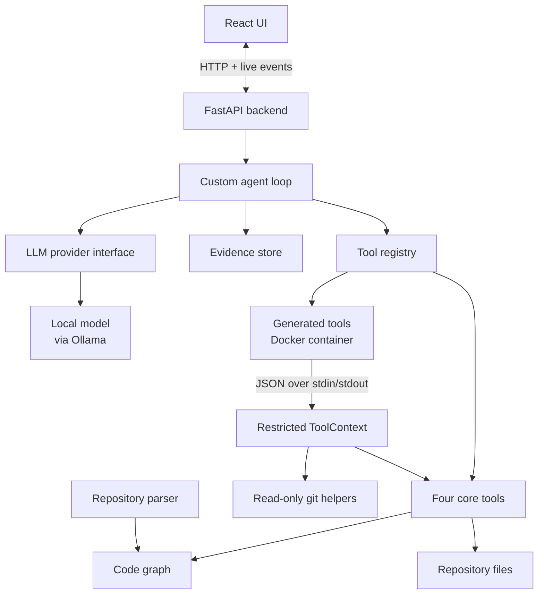

# AI Engineering Assistant — MVP Technical Plan

## 1. Problem understanding

The goal is an assistant that answers questions about a repository it has never seen: code structure, execution flows, dependencies, implementation behaviour and documentation. Such questions span many files. "What happens when an order is created?" needs the route, its handler, the functions it calls and the database code behind them. Text search finds the pieces but not how they connect, so the assistant also needs a graph of relationships between code elements: the GraphRAG part.

The assignment also requires a custom agent loop with no agent frameworks (LangGraph, LangChain Agents, CrewAI, AutoGen); 3–4 general-purpose starting tools whose results the agent can combine; the ability to notice when those tools are not enough and create, validate and use a new tool during a task; a single-screen React UI with Markdown, Mermaid and visible agent activity; and a locally runnable stack, a GitHub repository from day one, and a README with setup, assumptions and limitations.

## 2. Architecture overview

The MVP is deliberately small: a React UI, a FastAPI backend containing the agent, a code graph built from the repository, and a local LLM, and throwaway Docker containers for running generated tools.



The repository is parsed once into a code graph. For each question, the agent calls tools to search the graph, follow relationships and read source, keeping full results in an evidence store, then answers with file and line references. Generated tools run in a throwaway Docker container and reach repository data only through a restricted ToolContext (section 6). Breeze and MCP are not part of the running application.

## 3. Repository ingestion and code graph

The user enters a Git URL or local path. The backend clones it into a local workspace, records the commit, and parses it into a code graph without executing any of its code.

**Ingestion safety.** All file access stays inside the repository root, using simple configurable limits. Paths are resolved to canonical form and rejected if outside the root, including outward symlinks. Skipped: `.git` internals, virtual environments, dependency/vendor directories (`site-packages`, `node_modules`) and build output (`build`, `dist`, `__pycache__`). Binary files and files over 1 MB are not indexed or returned by `read_file`; repositories over 5,000 files are rejected. Git history is available only through the read-only git helpers (section 6).

**Parsing.** Python repositories only for the MVP, using Python's built-in `ast` module; other languages can be added later behind the same parser interface.

| Nodes | Edges |
| --- | --- |
| File/module, class, function/method | CONTAINS, IMPORTS, INHERITS |
| Route (e.g. `@router.post("/orders")`) | HANDLES (route → handler) |
| Documentation section (README/Markdown headings) | MENTIONS (doc section → symbol) |
|  | CALLS (function → function, with resolution status) |

Each node stores its name, path, line range and docstring, used by search alongside the source text.

**Call resolution.** Each CALLS edge is marked **resolved** (one target found via imports or same-module definitions), **ambiguous** (several candidates, e.g. `self.repo.save()` where several classes define `save`; all are listed), or **unresolved** (no target found, e.g. injected objects, polymorphism, `getattr`). Only resolved edges count as confirmed execution paths; for the others the agent reads the source and states any remaining uncertainty. No type-inference engine is built.

**Documentation links.** Markdown is split into sections by heading; code-formatted and dotted names are matched against graph symbols, and a MENTIONS edge is created only for an exact match to one symbol. No LLM is used for indexing.

**Storage.** NetworkX, saved to a file so it is not rebuilt on every restart. No graph database is needed at this size.

## 4. GraphRAG retrieval

Retrieval combines text matching with graph relationships in three steps, carried out by the agent through its tools:

1. **Find a starting point:** ranked lexical search over symbol names, paths, docstrings, route paths, source text and Markdown docs, with exact symbol and route matches first.
2. **Follow relationships:** CALLS for flows, IMPORTS for dependencies, CONTAINS for structure, MENTIONS for docs. Only resolved CALLS edges are followed as confirmed; the rest are flagged for source inspection.
3. **Ground in source:** read the code of the nodes that matter, so answers cite real lines.

Example, "What happens when `create_order()` runs?": search finds the node, CALLS edges lead to `validate_order` and `save_order`, their source is read, and the LLM writes a cited answer. Unlike plain RAG, the graph brings in connected code that shares no words with the question, such as a database function two calls away.

Embedding search is not in the MVP; it will be added only if evaluation shows lexical retrieval misses.

## 5. Custom agent loop and core tools

The agent is a plain Python loop around the LLM's tool-calling feature; no agent framework is used.

| Core tool | What it does |
| --- | --- |
| `search_code` | Ranked lexical search over symbols, paths, docstrings, routes, source text and docs; returns node IDs or file:line matches |
| `query_graph` | Related nodes (callers, callees, imports, contents, route handlers) up to a chosen depth |
| `read_file` | Source lines with line numbers |
| `list_files` | Directory structure |

These cover all five question types while leaving real gaps (section 6).

**Agent actions.** Each LLM response is parsed into one of three structured actions, keeping the loop deterministic and testable: **ToolCall** (native tool-use request; arguments validated against the tool's JSON schema), **CapabilityGap** (a reserved `report_capability_gap` schema sent with the tools but never executed as one: missing capability, why existing tools fall short, example input and expected output), and **FinalAnswer** (the grounded Markdown answer). Invalid actions are returned to the model as errors and count toward the step limit.

**The loop.** Send the system prompt, question, available tools and gap schema. On a ToolCall, run it, store the full result in the evidence store under an ID (`E1`, `E2`, …) and return a compact version. On a CapabilityGap, the system builds a new tool (section 6) and adds it to the available tools. On a FinalAnswer, validate citation references (section 7) and return it. Stop after **12 tool rounds**; at the limit the agent answers with what it has and states what is unresolved.

**Evidence store.** Full results stay on the backend rather than piling up in the conversation. The LLM gets compact versions (capped source excerpts; graph results trimmed to names, paths, lines and call status); older ones shrink to a one-line summary with their ID, and the agent re-reads a narrower range if needed. The UI shows full results on click.

The agent combines results across steps, e.g. a route from `search_code`, its call chain from `query_graph` and the SQL from `read_file`. Tool calls run one at a time, keeping the activity panel easy to follow. Each step emits an event (tool called, result, gap detected, tool created, answer) streamed to the UI.

## 6. Capability gaps and dynamic tool creation

When the core tools cannot answer part of a question, the agent reports the gap, the system creates and validates a small Python tool, and the agent uses it in the same task.

**Detecting a gap.** Tool creation is an internal system capability, not one of the agent's tools, so the agent genuinely starts with four. The agent reports a CapabilityGap (section 5) stating what it needs, why existing tools are insufficient, and an example input. The system prompt tells it to report gaps rather than guess; each report appears in the activity panel with its reason.

| Kind of gap | Example question | Why core tools fall short | Generated tool |
| --- | --- | --- | --- |
| Missing information source | "When was `create_order` last changed, and by whom?" | No core tool reads git history | `function_history(symbol)`: finds the function's lines, blames them, summarises commits |
| Too many steps | "Which functions are never called anywhere?" | `query_graph` works one node at a time | `find_uncalled_functions()`: checks all functions' callers in one run |

**Creating the tool.** To suit a small local model, the LLM only fills in the body of a fixed `run(args, ctx)` template, guided by one complete example tool in the prompt. It returns the code, an input schema and one example input as JSON, enforced by the model's JSON-schema output mode. The code is statically checked, test-run on the example, and its output checked against the schema. On failure, errors go back to the LLM for **one** retry; if it fails again, the agent continues and reports the gap as unresolved. A validated tool is registered for the current session only, and its code and validation result are saved to disk for review.

**What a generated tool can access.** `ctx` is a restricted ToolContext and the only route to repository data. It offers `search_code`, `query_graph`, `read_file` and `list_files` (same rules as the core tools); `list_nodes(kind)` for bulk questions; and narrow read-only git primitives `git_log(path, limit)` and `git_blame(path, start, end)`, executed by the backend. Generated tools never receive the raw graph, backend objects, or unrestricted file, git, process or network access; their value comes from composing these primitives into a new operation.

**How it runs.** Each run starts a fresh, throwaway Docker container: `docker run --rm -i --network none --read-only` with a 256 MB memory limit, 1 CPU and a 10-second timeout. The repository is not mounted and no secrets are passed in. The tool's `ctx` stub writes one JSON request (`{method, args}`) per line to stdout and reads the JSON reply from stdin; the backend runs only allowlisted methods with the same validation as the core tools. Only JSON crosses the container boundary, so `ctx` works without any network.

**Safety rules.** Static check before running: allowlisted imports only (e.g. `re`, `json`, `collections`, `itertools`, `math`); rejects `eval`, `exec`, `compile`, `open`, `__import__`, `os`, `sys`, `subprocess`, network modules and any double-underscore names or attributes. The container is the isolation boundary: no network, read-only filesystem, no repository mount, and enforced CPU, memory and time limits. Generated tools cannot create other tools or widen their access. Containers give real isolation for an MVP, though **not VM-level isolation**.

## 7. Grounded answers

Answers must be based on what the tools returned and show where each statement came from.

- **Citations:** factual statements cite evidence IDs and locations, e.g. "`create_order` validates the payload before saving [E3, `app/services/orders.py:42`]"; clicking one shows the evidence.
- **No unsupported claims:** the system prompt requires every claim to be grounded in retrieved evidence, and inferred or unconfirmed points (such as ambiguous calls) to be stated as such.
- **Citation reference validation:** before display, the backend checks that every cited evidence ID exists in the session and flags any that do not. This proves references are real, not that the evidence supports each claim.
- **Markdown and Mermaid:** flow and dependency answers include a Mermaid diagram built from the nodes actually visited, with ambiguous or unresolved calls as dashed lines. If a diagram fails to render, the UI shows its source text.

## 8. React interface

One screen with three areas, updated live via Server-Sent Events:

```
+-----------------------------------------------------------------+
| Repo: <url or path>  [Load]   Indexed @ a1b2c3 · 812 nodes      |
+------------------------------+----------------------------------+
| Chat                         | Agent activity                   |
|                              |  search_code "create_order"   ✓  |
| Q: What happens when an      |  query_graph CALLS depth 2    ✓  |
|    order is created?         |  read_file orders.py:30-80    ✓  |
|                              |  Gap: no git history tool        |
| A: ## Flow                   |  Created function_history ✓      |
|    [Mermaid diagram]         |  function_history create_order ✓ |
|    ... [E3]                  |  Citation refs validated: 6/6    |
|                              |                                  |
| [ Ask a question...     ]    |  (click a step for details)      |
+------------------------------+----------------------------------+
```

The repository bar shows indexing progress, commit and graph size; the chat renders Markdown, Mermaid and clickable citations. Each activity step shows tool, key arguments, result summary, time and status, with gaps and created tools highlighted; clicking a step shows the full result or a generated tool's code and test result. The panel shows **actions, not private reasoning**: no model chain-of-thought.

## 9. Technology stack and local execution

Everything runs locally, including the LLM; no database server, vector store, hosted API or agent framework is needed.

| Component | Choice | Reason |
| --- | --- | --- |
| Frontend | React + TypeScript (Vite) | Required React UI; light setup |
| Markdown / diagrams | react-markdown, Mermaid | Required response formats |
| Backend | Python + FastAPI | Same language as parser and generated tools; simple streaming |
| Code parsing | Python `ast` | Built in; reliable for Python |
| Code graph | NetworkX, saved to a file | Graph traversal without a database |
| Agent | Custom Python loop | Required: no agent frameworks |
| LLM | Local ~4B model via Ollama (Qwen3 4B or Gemma 4 E4B; Gemma 2B as fallback) | Runs offline on a laptop CPU, as advised in review; supports tool calling; behind a small provider interface so the model can be swapped |
| Generated tools | Throwaway Docker container per run, static checks, JSON-only ToolContext | Container isolation for untrusted code, as advised in review |

**Running it.** Install Docker Desktop and Ollama, pull the chosen model, clone the GitHub repository, and start the backend and frontend with the README commands. No external API calls are made, so repository content never leaves the machine. The GitHub repository exists from the start, with small, meaningful commits.

**Designing for a small model.** A ~4B model on a laptop CPU is slower and less reliable than a large hosted model, so its job is kept small: short tool descriptions, compact evidence in context, structured actions, JSON-schema output for tool specs, and a fixed template for generated tools. The model is chosen with a one-hour test of speed and single tool calls in phase 1.

## 10. Breeze development workflow

Breeze is a development-time tool only; neither Breeze nor MCP is used by the running application. Once our GitHub repository exists, it is indexed in Breeze through Breeze MCP, creating a code ontology of our own codebase, refreshed at meaningful development milestones using the supported Breeze workflow. Claude uses it during development to navigate the evolving code, as Breeze would be used on a brownfield project. This ontology is separate from the code graph the assistant builds for the repositories it analyses.

## 11. Implementation phases and evaluation

Development starts only after this plan is reviewed. Each phase ends in something that works and is committed.

| Phase | Work | Done when |
| --- | --- | --- |
| 1. Setup | GitHub repo, backend and frontend skeletons, README, Breeze indexing; install Docker and Ollama; one-hour model selection test | Both apps start locally |
| 2. Code graph | Load repo with path/size limits, parse with `ast`, build and save graph with call status | Demo repo graph built and inspectable |
| 3. Core tools | Four tools with unit tests | Correct results on demo repo |
| 4. Agent loop | Structured actions, evidence store, step limit, event streaming | Multi-step questions answered from the command line |
| 5. Dynamic tools | Gap handling, templated generation, static checks, Docker runner with JSON ToolContext, test run, registration, audit files | Both example gaps produce working tools |
| 6. UI | Repository bar, chat with Markdown/Mermaid, activity panel | Full flow usable in the browser |
| 7. Evaluation and README | Run question set, fix issues, document setup, assumptions, limitations | Results in README |

**Demo repository.** A small-to-medium public Python web app with a clear route → service → data-access flow and a README; proposed candidate [fastapi-realworld-example-app](https://github.com/nsidnev/fastapi-realworld-example-app), confirmed in phase 2.

**Evaluation.** Twelve questions, each with an expected answer written by reading the code:

| # | Case | Expected behaviour |
| --- | --- | --- |
| 1 | Simple symbol lookup | Correct location, cited |
| 2 | Multi-hop flow (route → database) | Correct chain with diagram, cited |
| 3 | Dependency/import | Correct modules, cited |
| 4 | Documentation | Answer from README, cited |
| 5 | Ambiguous call (`self.repo.save()`) | Candidates listed, uncertainty stated |
| 6 | Nonexistent symbol | Not found; nothing invented |
| 7 | Runtime-only information | Explains static analysis cannot establish it |
| 8 | Git history of a function | Gap reported; `function_history` created and used |
| 9 | Never-called functions | Gap reported; tool created and used |
| 10 | Answerable with existing tools | No tool created |
| 11 | Tool fails validation (scripted invalid code) | One retry, then gap reported unresolved |
| 12 | Main modules and layers | Correct overview, cited |

For each we record correctness, whether citations are valid and support the claims (checked by hand), whether a tool was created only when needed, and step count. Results and failures go in the README.

## 12. MVP and stretch goals

The proposed MVP is designed to cover the currently understood assignment requirements, subject to the assumptions and review outcomes in section 13. Stretch goals start only once the MVP works end to end.

| Area | MVP | Stretch |
| --- | --- | --- |
| Repository and graph | Python, `ast` graph with call status, path/size limits, saved to file | Other languages (e.g. tree-sitter) |
| Retrieval | Ranked lexical search plus graph traversal | Embedding-based semantic search |
| Agent loop | Four core tools, structured actions, evidence store, sequential calls, 12-round limit, local LLM | Parallel tool calls |
| Grounding | File:line citations, citation reference validation | Name-existence check; semantic citation checking |
| Dynamic tools | Gap reported, tool generated from template, checked, test-run in a Docker container; JSON ToolContext; one retry; session-only | Tools kept across sessions |
| Deployment | Backend and frontend run natively; generated tools in containers | Full Docker Compose stack |
| UI | Repository bar, chat, activity panel; Markdown/Mermaid with fallback | Graph visualisation, session replay |
| Evaluation | 12 questions incl. uncertainty and failure cases | Larger question set |

**If time runs short**, scope is reduced in this order without dropping any assignment requirement: a plainer UI, 8 evaluation questions instead of 12, and demonstrating one gap type (git history) instead of two.

## 13. Assumptions, limitations and review outcomes

**Assumptions:** Python-only is acceptable for the MVP; Docker Desktop and Ollama can be installed on the development machine; repositories are small to medium (up to tens of thousands of lines) so the graph fits in memory; one user and one repository at a time.

**Known limitations**

- Static analysis shows dynamic Python behaviour (dependency injection, polymorphism, reflection) as ambiguous or unresolved calls; the agent inspects source and reports uncertainty.
- Retrieval is lexical, so questions worded differently from the code may need more search steps.
- Citation validation confirms cited evidence exists, not that it supports each claim.
- A local ~4B model on a laptop CPU is slower and less reliable at multi-step tool use than large hosted models; a complex answer may take a few minutes.
- Generated tools run in containers with no network or repository access, which is real isolation for an MVP but not VM-level.
- Generated tools last for one session only.
- The analysed application is never run, so runtime values, performance and test coverage cannot be reported.

**Review outcomes**

1. **Runtime LLM:** a local model of about 4B parameters, with Gemma 2B as an option. Adopted: Ollama with the model chosen by the phase 1 test.
2. **Generated-tool isolation:** containerisation is recommended. Adopted: every generated tool runs in a throwaway Docker container; containerising the full app is a stretch goal.
3. **Timeframe:** the schedule cannot be extended, so the "if time runs short" order in section 12 applies.
